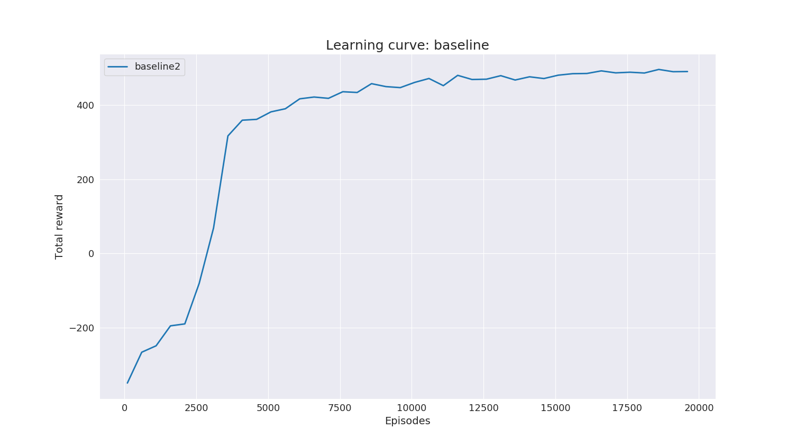

# AE4350: Final Project
## Mult-Agent Reinforcement Learning For Drone Flocking

> Name: Nikhil Sethi

> Student Number: 5711428

> Date: 11/07/23 

This repository contains code for the final project completed for the course Bio-inspired Learning for Aerospace Applications. My aim was to use MADDPG to train 4 drones to flock together in a confined environment.

## Results

Video at test time
<kbd>
<p align='center'></p>
</kbd>

Learning curve:
<p align='center'></p>

## Prerequisites
The repository was tested with the following versions. Even though they are fairly old, it is highly recommended that you create a virtual environment and use the same versions because they include dependencies from the authors of the main MADDPG repository.

- Ubuntu 18.04
- Python 3.5.10
- Tensorflow 1.8.0
- gym 0.10.5
- matplotlib 3.0.3
- protobuf 3.19.6


## Setup

```
git clone git@github.com:nikhil-sethi/marl_flocker.git
cd marl_flocker
git submodule update --init --recursive
cd maddpg/
pip3 install -e .
cd ..
cd multiagent-particle-envs
pip3 install -e .
cd ..
```

## Training
```
cp scenarios/flocking.py multiagent-particle-envs/scenarios/

cd maddpg/experiments
python train.py --scenario flocking --num-episodes 20000 --save-rate 100 --save-dir <path/to/this/repo>/results/policy
```

## Testing
```
python train.py --restore --display --scenario flocking --load-dir <path/to/this/repo>/results/policy
```

## Plots
To reproduce the plots from the paper:
```
pip install seaborn
python stat.py
```

